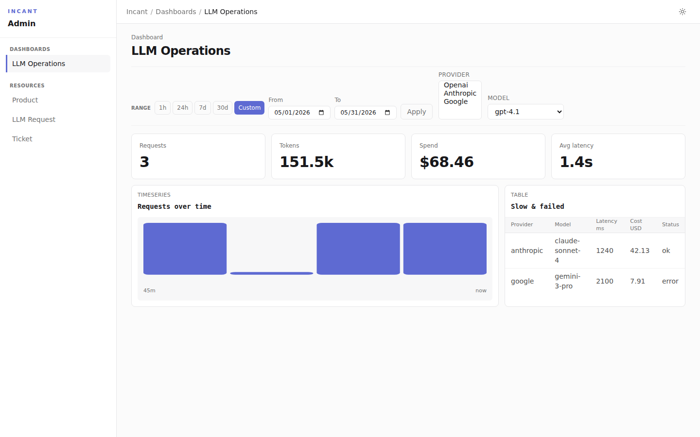

# Incant

Incant is an Elixir/Phoenix-native admin framework. Describe your resources, dashboards, and themes in plain Elixir, and Incant renders a polished LiveView admin for them — tables, forms, filters, dashboards, and row actions, with dark mode and a sensible default theme included.

```elixir
def deps do
  [
    {:incant, "~> 0.1"}
  ]
end
```



> **Status:** Incant is pre-1.0 and evolving. The DSL and adapter contracts may still change between releases; see the [changelog](CHANGELOG.md) before upgrading.

## Why Incant

- **Code-first, not click-first.** Resources, dashboards, and themes are ordinary Elixir modules you can diff, test, and review — no admin state hidden in a database.
- **A real UI out of the box.** The default LiveView adapter renders dense, responsive tables, detail views, forms, filters, and dashboards, in light and dark mode.
- **Describe intent, not markup.** A semantic UI document layer means your definitions are inspectable metadata, testable without a browser.
- **Fits your app.** Mount it in any Phoenix router, run it as a standalone service, or drive it from another node over RPC.

## Quick start

Add the dependency and run the installer in a Phoenix app:

```sh
mix incant.install
```

The Igniter-powered installer creates an admin root, a sample resource, and a theme, and patches your router and app CSS. Then mount the admin and visit `/admin`. See [docs/install.md](docs/install.md) for details and fallback snippets.

For the frontend behaviors (theme toggle, dialogs, controls), import them from your `assets/js/app.js`:

```js
import { mountIncant } from "incant";

mountIncant();
```

## A resource in a few lines

```elixir
defmodule MyApp.Admin.Resources.Product do
  use Incant.Resource,
    schema: MyApp.Catalog.Product,
    repo: MyApp.Repo

  table do
    column :name, link: true
    column :status, as: :badge
    column :price, format: :money

    filter :status, :select, options: [:draft, :active, :archived]

    action :archive, confirm: "Archive this product?", destructive: true
    search [:name]
  end
end
```

That gives you a searchable, sortable, filterable, paginated table with a destructive-confirm archive action — no templates written.

## Dashboards without chart markup

```elixir
defmodule MyApp.Admin.Dashboards.Operations do
  use Incant.Dashboard

  title "Operations"

  grid columns: 12 do
    stat :total_requests, span: 3, label: "Requests", query: &MyApp.Metrics.total_requests/2
    stat :total_tokens, span: 3, label: "Tokens", format: :compact_number, query: &MyApp.Metrics.total_tokens/2
    stat :avg_latency, span: 3, label: "Avg latency", format: :duration_ms, query: &MyApp.Metrics.avg_latency/2

    timeseries :requests_over_time, span: 8, query: &MyApp.Metrics.requests_over_time/2
  end
end
```

Values are formatted for you — compact numbers (`151.5k`), human durations (`1.4s`), money, relative times.

## Where to go next

- [Installation](docs/install.md) — installer behavior and manual setup
- [Resources, filters, forms, actions, and query-backed data](docs/resources.md)
- [Dashboards and variables](docs/dashboards.md)
- [Datasets and analytical tables](docs/datasets.md)
- [Authorization and policy scoping](docs/authorization.md)
- [Design tokens and themes](docs/design.md)
- [Architecture](docs/architecture.md) and the [docs index](docs/README.md)

See [PLAN.md](PLAN.md) for the product thesis, [CONVENTIONS.md](CONVENTIONS.md) for the recommended application structure, and [examples/playground](examples/playground/README.md) for a runnable example app.

## Development

```sh
mix deps.get
mix test
mix ci        # compile, format check, test, Credo, Dialyzer, ExDNA, Reach
```

Browser code is authored in TypeScript and built, formatted, linted, type-checked, and tested through Volt; Node.js is not required.

## License

[MIT](LICENSE)
